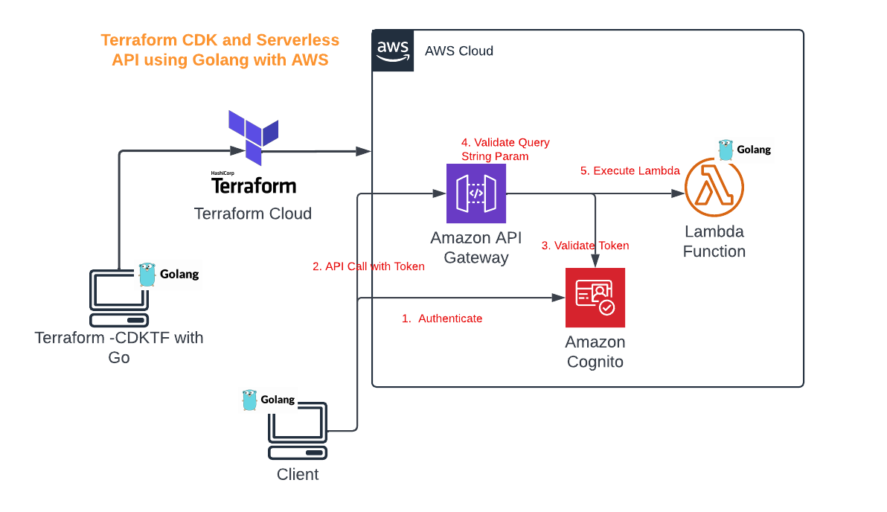

## Golang based on Application based on AWS Serverless
 
## Deployment using infra as code

### CDKTF Setup on Ubuntu WSL
1. Install Latest Terraform (https://www.terraform.io/downloads)

```bash
wget -O- https://apt.releases.hashicorp.com/gpg | gpg --dearmor | sudo tee /usr/share/keyrings/hashicorp-archive-keyring.gpg
echo "deb [signed-by=/usr/share/keyrings/hashicorp-archive-keyring.gpg] https://apt.releases.hashicorp.com $(lsb_release -cs) main" | sudo tee /etc/apt/sources.list.d/hashicorp.list
sudo apt update && sudo apt install terraform
```
2. Install NodeJS (https://github.com/nodesource/distributions/blob/master/README.md)
```bash
# Using Ubuntu
curl -fsSL https://deb.nodesource.com/setup_18.x | sudo -E bash -
sudo apt-get install -y nodejs

```

### Initialize go based 
```bash
cdktf init --template=go --project-name goserverlesaws --project-description "A Project for implementing a Golang based Serverless Application into AWS Cloud"

go get github.com/hashicorp/cdktf-provider-aws-go/aws/v9

```

## Application

### Architecture



### Build Lamda Code
```bash
# Remember to build your handler executable for Linux!
GOOS=linux GOARCH=amd64 go build -o main main.go
```

### Deploy to AWS via Terraform Cloud
```bash
cdktf deploy

```
### Test API via Go based client
1. Create a user using AWS console into AWS Cognito
2. Build a Client and run
```bash
cd basic-lambda-client
go build -o client main.go
./client
```
